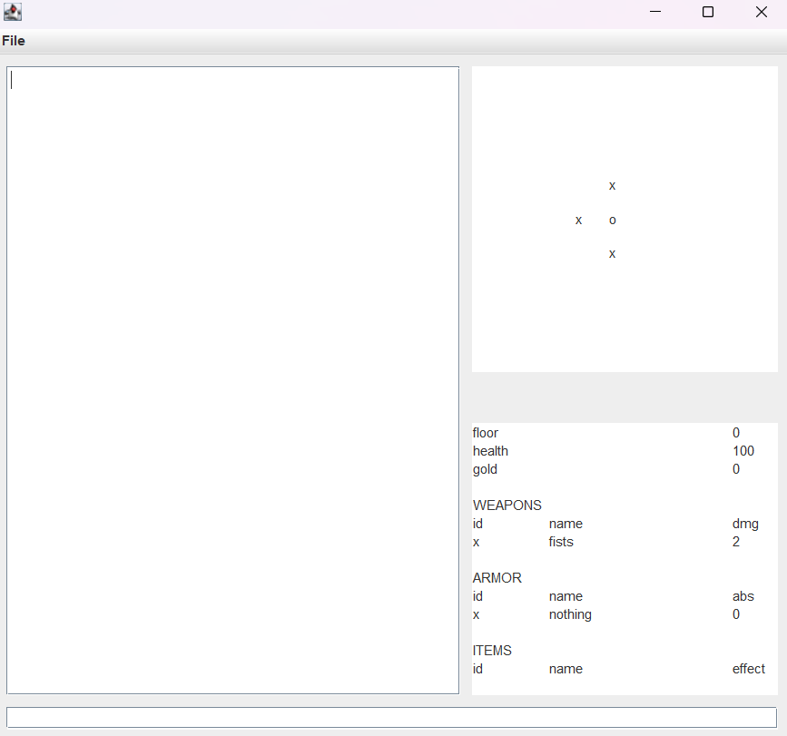

# Tower of Text
## Beschreibung
Tower of Text ist ein textbasierter roadlike Dungeon crawler. 
Es kann durch Ausführen der Textadventure.jar Datei gestartet werden.

## Überblick
In Tower of Text gibt der Spieler dem Spiel durch Textbefehle Anweisungen. Man bewegt sich durch ein zufällig generiertes Dungeon, 
sammelt Waffen, Rüstungen, Verbrauchsgegenstände und Goldmünzen und bekämpft verschiedene Monster.
Der Dungeon besteht aus mehreren Ebenen, welche immer stärkere Gegenstände und Gegner enthalten.
Von den Coins kann man sich in einem Shop die Gegenstände einer Ebene kaufen.
Man findet Gegenstände auch im ersten Raum des Dungeon und in sogenannten "Chest rooms".
Um eine Ebene aufzusteigen, muss man sich in einem sogenannten "End room" befinden.

## GUI Erklärung

Im unteren Teil befindet sich das Texteingabefeld, hier gibt man die Textbefehle ein.
Im linken Teil des Fensters befindet sich das Ausgabefeld, in diesem gibt das Spiel Informationen zurück.
Im oberen rechten Teil befindet sich eine Karte der Ebene, welche alle bekannten Räume zeigt.
Ein raum gilt als bekannt wenn man einmal in einem Nachbar des Raums oder dem Raum selbst war.
Das o zeigt den Raum an in dem man sich gerade befindet.
Der untere linke Teil besteht aus den Inventarinformationen, sowie der Ebenen-, Lebens und Goldcoin-Information
Ein x markiert den ausgerüsteten Gegenstand.

## Bewegung

## Inventar

## Kampf

## Besondere Räume

## used tools

- kotlin
- IntelliJ IDEA
- swing
- gitHub

## project structure

- rigid separation into model, view, controller (see below)
- main class launches controller, which in turn launches view and model
- all communication according to diagram
- view is separated according to major components which extend the classes provided by swing
- model and View have class structure of multiple subclasses Controller is its own class
- model class contains a map hero and the Data for the UI-info
- the model also contains the object base containing items, entities and other
- the View contains UI components in separate classes and exposes APIs for the controller

## Development

- development in spiral model
- implementing new features and testing them until they work and fit into game
- no task separation between developers because project is very interconnected, changes in one part effect other parts
  drastically

## Features

- UI
    - menu bar (top)
    - text input (bottom)
    - text output/history (center)
    - map (top right)
    - inventory/status (bottom right)
    - 
- random map generation
    - rooms
        - NPCs (non-playable character)
            - monsters
            - bosses?
            - other heroes?
        - chests
        - minigames to unlock next rooms?
- movement between rooms
- items
    - keys?
    - weapons
    - armor/other (backpacks etc.)
    - consumables?
        - potions with effects
        - healing
- combat
    - attacks
    - evasions/other options?
        - having to provide an input in a specific time
    - rewards after defeating enemies
- progression?
    - locked doors
    - reaching of new floors with harder enemies
    - story/at least context

point marked with ? considered nice to have but optional

## Roadmap

- [X] UI 15.1.
- [X] map generation 27.1
- [X] movement 22.1.
- [X] items and entities in rooms 31.1.
- [X] simple combat 10.2.
- [ ] advanced combat 24.2.
- [ ] progression 10.3.
