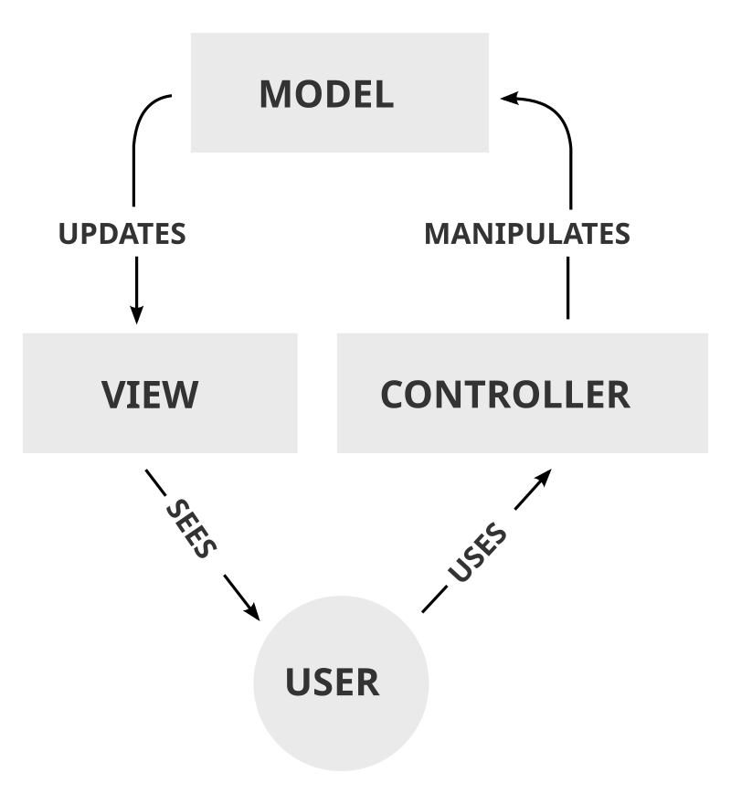
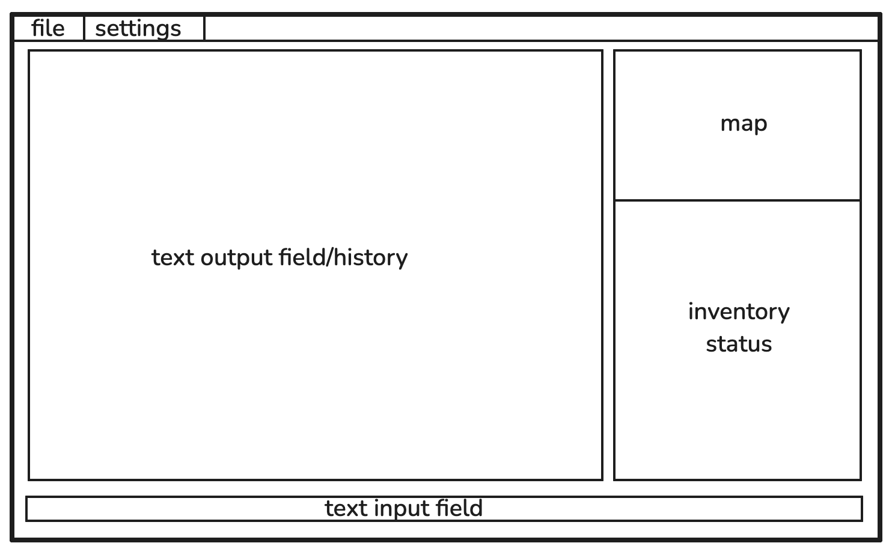

# text adventure part 2 (title wip)

## used tools

- kotlin
- swing
- (git)

## project structure

- rigid separation into model, view, controller (see below)
- main class launches controller, which in turn launches view and model
- all communication according to diagram
- view is separated according to major components which extend the classes provided by swing

## Development

- development in spiral model
- implementing new features and testing them until they work and fit into game

## Features

- UI
    - menu bar (top)
    - text input (bottom)
    - text output/history (center)
    - map (top right)
    - inventory/status (bottom right)
    - 
- random map generation
    - rooms
        - NPCs (non-playable character)
            - monsters
            - bosses?
            - other heroes
        - chests
        - minigames to unlock more rooms?
- movement between rooms
- items
    - keys
    - weapons
    - armor/other (backpacks etc.)
    - consumables?
        - potions with effects
        - healing
- combat
    - attacks
    - evasions/other options?
        - having to provide an input in a specific time
    - rewards after defeating enemies
- progression?
    - locked doors
    - reaching of new floors with harder enemies
    - story/at least context

point marked with ? considered nice to have but optional

## Roadmap

- [ ] UI 15.1.
- [ ] map generation 22.1
- [ ] movement 29.2.
- [ ] items 10.2.
- [ ] combat 24.2.
- [ ] nice to have 10.3.